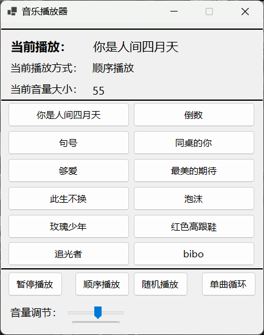
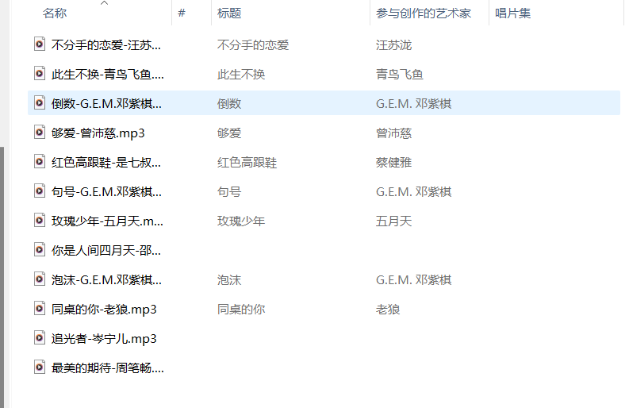

# NewPlayer 音乐播放器

NewPlayer 是一个基于 .NET 8、Windows Forms 和 NAudio 开发的轻量化本地音乐播放器。

本项目专注于本地音乐播放，不提供、内置或分发任何音乐资源。用户需要自行准备合法来源的本地音乐文件。

## 简介

NewPlayer 是一个简单、轻量的 Windows 本地音乐播放器，支持扫描本地 `Music` 文件夹中的音乐文件，并提供播放、暂停、上一首、下一首、音量调节和播放模式切换等基础功能。

当前版本主要用于学习、课程设计、个人练习和本地播放器功能演示。

## 项目使用约定

本项目基于 AGPL-3.0 协议开源，使用或二次开发时请遵守对应开源协议。

1. 本仓库只包含播放器源码，不包含任何音乐资源。
2. 请勿上传、传播或提交未经授权的音乐文件。
3. 如果你基于本项目进行修改、分发或部署，请保留原项目声明并遵守开源协议。
4. 如果你发现项目中存在问题，欢迎通过 Issue 或 Pull Request 反馈。

## 特性

- 本地播放：播放用户本机的 MP3 音乐文件。
- 自动扫描：启动时扫描程序目录或项目目录下的 `Music` 文件夹。
- 歌曲解析：根据 `歌名-歌手.mp3` 的文件名格式解析歌曲名称和歌手。
- 播放控制：支持播放、暂停、上一首、下一首。
- 播放模式：支持顺序播放、随机播放、单曲循环等模式。
- 音量调节：支持在播放器界面中调节播放音量。
- 轻量化：界面简洁，依赖较少，适合作为 Windows Forms 音乐播放器学习项目。

## 使用方法

### 运行源码

1. 克隆或下载本项目。
2. 使用 Visual Studio 2022 打开 `newplayer.sln`。
3. 等待 NuGet 自动还原依赖。
4. 编译并运行项目。
5. 将自己的本地音乐文件放入 `Music` 文件夹。

### 音乐文件要求

当前项目默认扫描 `Music` 文件夹中的 `.mp3` 文件。

推荐文件名格式：

```text
歌名-歌手.mp3
```

示例：

```text
你是人间四月天-邵帅.mp3
句号-G.E.M.邓紫棋.mp3
```

如果文件名中没有 `-` 分隔符，程序会将完整文件名作为歌曲名，并将歌手显示为未知作者。

## 为什么项目在其他电脑上可能无法直接播放

本项目不会上传音乐文件到 GitHub。克隆项目后，如果 `Music` 文件夹中没有本地音乐，播放器界面可能不会显示可播放歌曲，或无法播放原作者本机中的歌曲。

这是正常现象。你需要在自己的电脑上准备音乐文件，并放入项目的 `Music` 文件夹或程序运行目录下的 `Music` 文件夹。

建议后续优化方向：

- 增加“选择音乐文件夹”功能。
- 增加“导入歌曲”功能。
- 将用户选择的音乐目录保存到配置文件。
- 支持更多音频格式，例如 `.wav`、`.flac`、`.m4a`。
- 增加歌曲列表刷新按钮。

## 应用截图

以下截图仅展示 UI 和本地音乐播放效果，软件内部不提供任何音乐资源。

> 你可以在仓库中创建 `docs/images/` 目录，将截图放入其中，然后取消下面的注释。

<!--


-->

## 项目结构

```text
newplayer/
├─ Core/                 播放控制、歌曲管理、播放模式等核心逻辑
├─ Helpers/              常量与异常处理
├─ Properties/           项目属性与发布配置
├─ UI/                   Windows Forms 界面
├─ Program.cs            程序入口
└─ newplayer.csproj      项目文件
```

## 开发环境

- Windows
- .NET 8
- Visual Studio 2022
- Windows Forms
- NAudio 2.2.1
